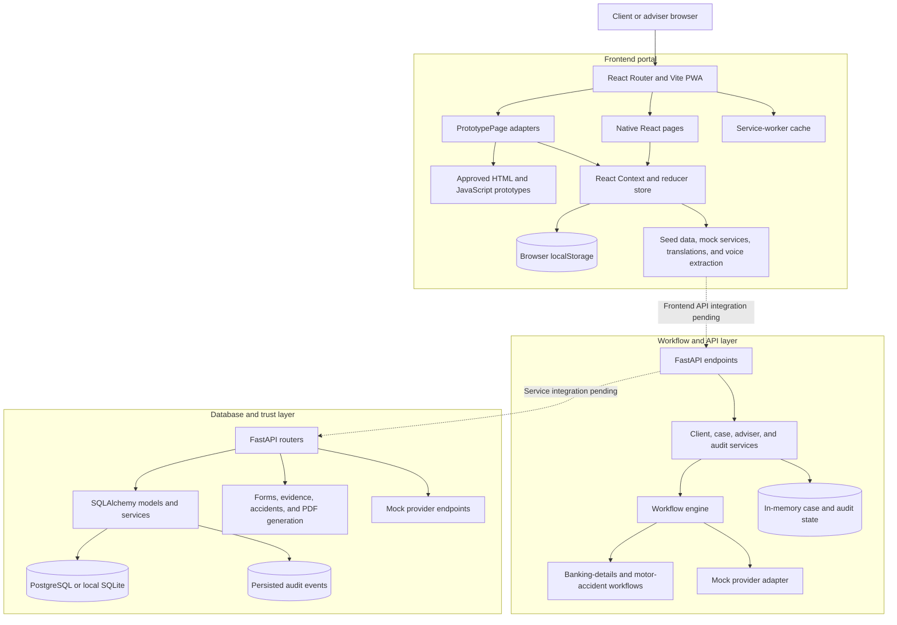

# Royal Square Portal

Royal Square Portal is a hackathon prototype for reducing administrative work in South African financial-advice operations. It combines a guided client portal, an adviser workspace, deterministic workflow orchestration, evidence and form handling, provider simulations, audit trails, and a relational trust layer.

> [!IMPORTANT]
> This repository is a product-validation demo. Provider interactions are mocked, the frontend currently persists demo state in the browser, and security or regulatory wording must be independently reviewed before production use.

## Repository overview

| Layer | Location | Responsibility | Current state |
| --- | --- | --- | --- |
| Portal | [`frontend/`](frontend/) | React/Vite PWA for client and adviser experiences | Runnable; combines native React pages with preserved HTML prototypes |
| Workflow and API | [`workflow_and_API_layer/`](workflow_and_API_layer/) | FastAPI orchestration, state transitions, audits, and provider adapters | Runnable against deterministic in-memory services |
| Database and trust | [`database_and_POPIA_trust_layer/`](database_and_POPIA_trust_layer/) | SQLAlchemy models, migrations, forms, evidence, PDF generation, and persisted APIs | Runnable with PostgreSQL or its local SQLite fallback |

## Current architecture



Solid arrows represent connections used by the current code. Dotted arrows identify the remaining integration boundaries: the frontend still uses its local store and mock-service layer, while the two backend packages currently run independently.

## Implemented capabilities

### Client portal

- Guided login, onboarding, FICA-style information capture, risk profiling, and signatures
- Banking-details case `#BD-2048` with validation, document upload, review, and state transitions
- Motor-accident case `#RSF-2841` with offline presentation, GPS, evidence, witnesses, voice capture, statements, sketches, and reminders
- Documents, consent forms, service requests, tasks, goals, reminders, and finances
- Shared demo state, audit events, Simple Mode, demo reset, and persisted language selection
- English, isiZulu, Sesotho, Afrikaans, and isiXhosa translations
- Installable PWA shell and service-worker caching

### Adviser workspace

- Adviser dashboard, triage inbox, client directory, case summaries, filters, and detail drawers
- Demo views for work waiting on clients, advisers, and providers

### Backend services

- Explicit banking-details and motor-accident workflow definitions
- Validated state transitions and owner-aware workflow steps
- Client, case, adviser, evidence, forms, accident-sync, audit, and provider endpoints
- Deterministic provider simulations for bank updates and motor claims
- SQLAlchemy relational schema, Alembic migrations, seed data, PDF generation, and audit records

## Main frontend routes

| Route | Experience |
| --- | --- |
| `/login` | Demo sign-in and persona selection |
| `/` | Client overview |
| `/onboarding` | Guided onboarding and information capture |
| `/requests` | Client requests and case status |
| `/documents` | Document vault |
| `/documents/suite` | Guided statutory-document suite |
| `/forms/client-consent` | Client consent workflow |
| `/banking-details` | Banking-details change workflow |
| `/accident` | Offline-capable accident capture |
| `/tasks` | Tasks and reminders |
| `/finances` | Financial overview and goals |
| `/adviser` | Adviser dashboard |
| `/adviser/inbox` | Adviser triage inbox |
| `/adviser/clients` | Adviser client directory |

## Quick start

### Prerequisites

- Node.js 20.17 or newer
- pnpm through Corepack
- Python 3.13 recommended
- PostgreSQL 16 for the intended persisted environment; local development can fall back to SQLite

### Frontend

```bash
cd frontend
corepack enable
pnpm install
pnpm dev
```

Vite serves the portal at `http://localhost:5173` by default.

```bash
pnpm test
pnpm build
```

The icon build runs automatically before development and production builds.

### Python environment

The database/trust requirements include the dependencies used by both FastAPI packages.

```bash
python3 -m venv .venv
source .venv/bin/activate
python -m pip install -r database_and_POPIA_trust_layer/requirements.txt
```

### Database and trust API

```bash
cd database_and_POPIA_trust_layer
alembic upgrade head
python seed.py
uvicorn src.main:app --reload --port 8000
```

API documentation is available at `http://localhost:8000/docs`.

To use a specific PostgreSQL database, set `DATABASE_URL` before migrations or startup:

```bash
export DATABASE_URL="postgresql+psycopg2:///royal_square"
```

Useful maintenance commands:

```bash
python verify_schema.py
python reset_db.py
python reset_db.py --empty
pytest
```

### Workflow and orchestration API

In a second terminal with the same Python environment activated:

```bash
cd workflow_and_API_layer
uvicorn app.main:app --reload --port 8001
pytest
```

API documentation is available at `http://localhost:8001/docs`.

## Demo data and state

- The frontend uses Latoya Matai, adviser Qiniso Ntuli, FSP 29370, banking request `#BD-2048`, and accident request `#RSF-2841` as its primary connected scenario.
- Frontend state is stored under `royal-square-client-portal-v1` in `localStorage`.
- Add `?demo=reset` to a portal URL to restore the seeded frontend state.
- Backend provider references and responses are deterministic simulations; no financial institution or insurer is contacted.

## Known integration work

- Connect the frontend service boundary to the FastAPI APIs and select one canonical persisted state model.
- Replace the remaining `PrototypePage` HTML hydration routes with their native React equivalents while preserving the approved appearance.
- Align canonical demo identities, workflow stages, statuses, and identifiers across both backend packages and the frontend.
- Add authentication, authorization, production file storage, encryption, deployment configuration, and reviewed compliance wording.
- Add end-to-end tests for the banking, consent, and accident demo journeys.
- Split the large frontend production bundle through route-level code splitting.
- Replace locally excluded source-document binaries with sanitized fictional fixtures before enabling original-file downloads in a deployment.

## Project documentation

- [Database schema contract](database_and_POPIA_trust_layer/contracts/SCHEMA_CONTRACT.md)
- [Trust and POPIA design summary](database_and_POPIA_trust_layer/contracts/TRUST_AND_POPIA_SUMMARY.md)
- [Workflow definitions](workflow_and_API_layer/app/workflows/)
- [Frontend state model](frontend/src/store.tsx)

## Repository hygiene

Raw design sources, original office documents, ZIP archives, package caches, generated builds, and superseded prototypes are intentionally ignored. The HTML files under `frontend/public/prototype/` and `frontend/public/prototype-adviser/` are still runtime dependencies and remain versioned until their routes are fully ported to native React.
